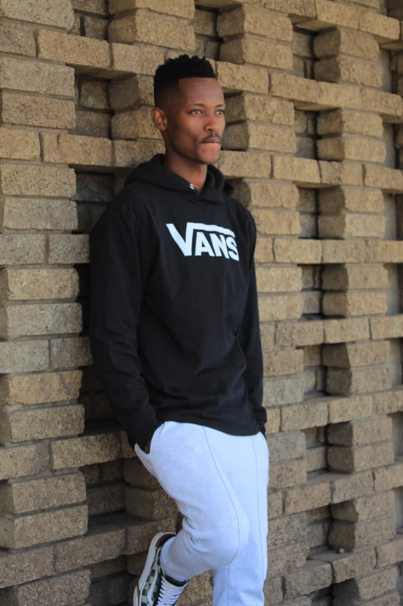

# Letsoenyo Clen Bongane - Portfolio

## Overview
This is my personal portfolio website showcasing my skills, projects, and background as a web developer student. The portfolio is designed to be responsive and user-friendly, highlighting my journey in web development and my educational background.

## Features
- **Responsive Design**: Works on all device sizes
- **Modern UI**: Clean and professional interface
- **Sections**:
  - Home/Introduction
  - About Me (with education details)
  - Interests
  - Skills (with progress bars)
  - Projects (with links to code and live demos)
  - Contact Form
- **Interactive Elements**:
  - Smooth scrolling navigation
  - Hover effects
  - Mobile-friendly hamburger menu

## Technologies Used
- HTML5
- CSS3 (with CSS Grid and Flexbox)
- Font Awesome icons
- Google Fonts (Poppins)

## Projects Showcased
1. **Emergency Response System** - In-progress emergency response system
2. **Nail Tech Website** - Website for a nail technician
3. **Music Video Production Website** - Showcase for a production company

## How to Use
1. Clone the repository or download the files
2. Open `index.html` in your browser
3. Navigate through the different sections using the menu

## Live Demo
The portfolio is hosted at [GitHub Pages](https://bongane0606.github.io/portfolio) (replace with your actual URL if hosted)

## Contact
- Email: bonganeclen@gmail.com
- Phone: +27 67 819 9887
- GitHub: [Bongane0606](https://github.com/Bongane0606)
- LinkedIn: [Clen Bongane](https://linkedin.com/in/Clen Bongane)
